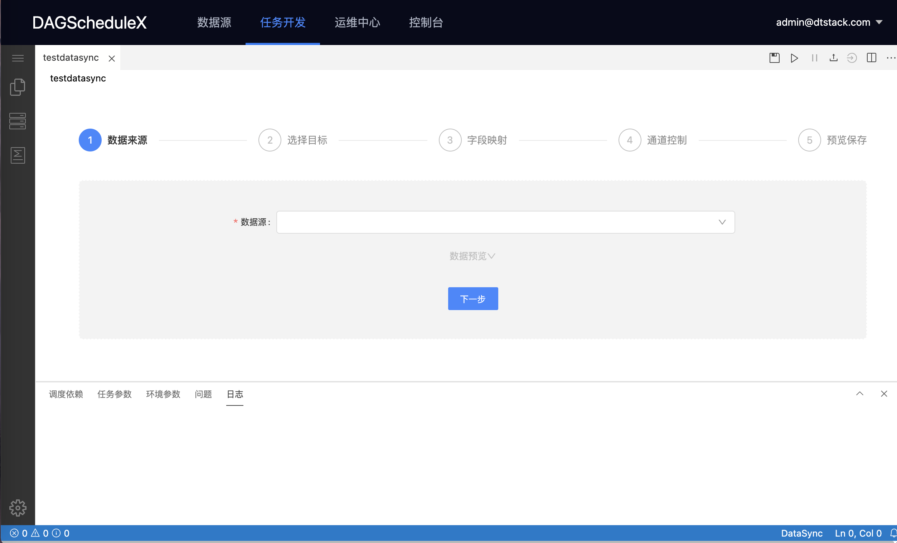
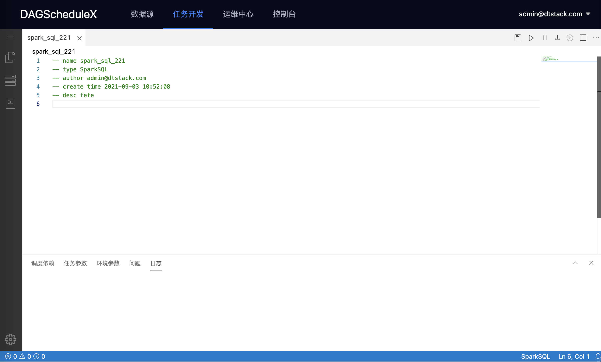
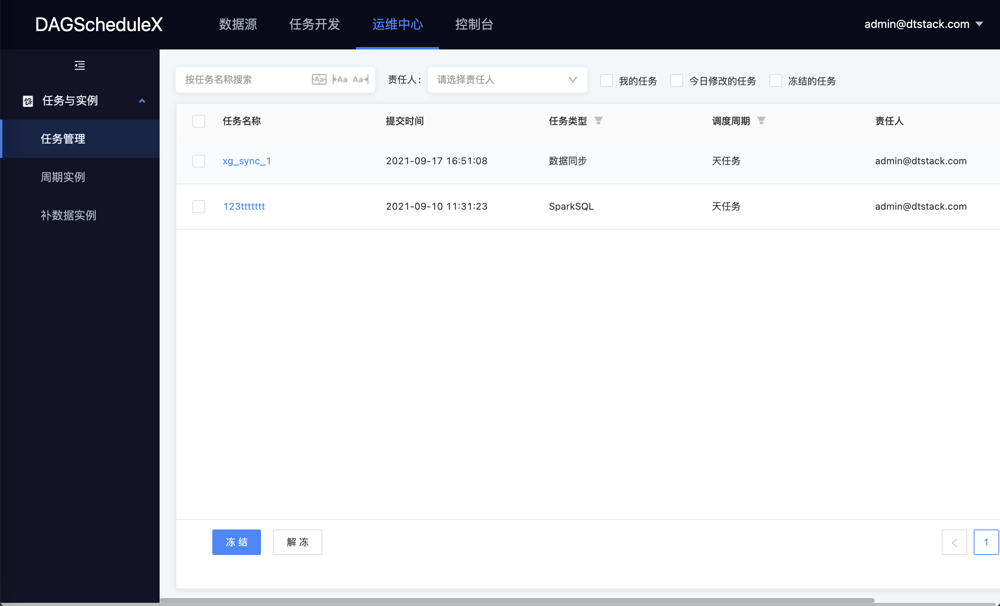
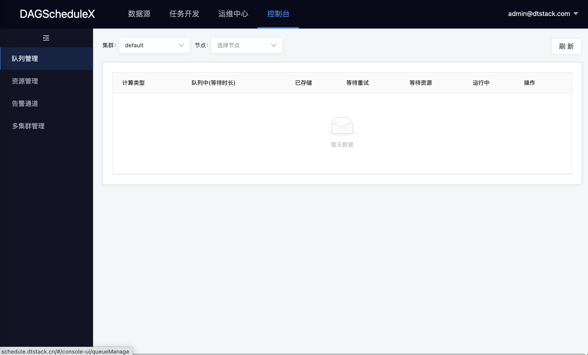
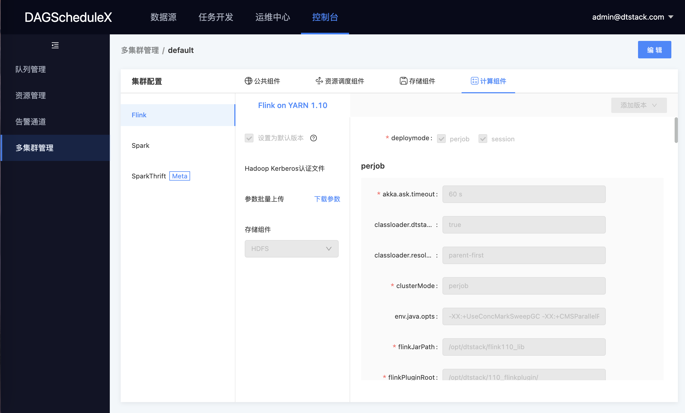

# Taier

Taier 脱胎于[袋鼠云](https://www.dtstack.com/) - [数栈](https://www.dtstack.com/dtinsight/) （一站式大数据开发平台），技术实现来源于数栈分布式调度引擎Engine，是[数栈](https://www.dtstack.com/dtinsight/) 产品的重要基础设施之一，负责平台所有任务实例的调度和提交运行。

## 功能特征

#### 稳定性
    * 单点故障：去中心化的分布式模式
    * 高可用方式：Zookeeper
    * 过载处理：分布式节点 + 两级存储策略 + 队列机制。每个节点都可以处理任务调度与提交；任务多时会优先缓存在内存队列，超出可配置的队列最大数量值后会全部落数据库；任务处理以队列方式消费，队列异步从数据库获取可执行实例
    * 实战检验：经近百家客户实战检验，部分客户的生产日均调度任务超过10万个
    
#### 易用性
    * 任务类型：Python、Shell、Jupyter、Tersorflow、Pytorch、Hadoop MR、Spark MR、PySpark、Flinkx、Flink MR、FlinkStreamSQL、Kylin、Odps、SQL(MySQL、PostgreSQL、Hive、SparkSQL、Impala、Oracle、SQLServer、TiDB、greenplum、inceptor、kingbase、presto)、Procedure、Sub_Process
    * 可视化工作流配置：支持封装工作流、支持单任务运行，不必封装工作流、支持拖拽模式绘制DAG
    * DAG监控界面：运维中心、支持集群资源查看，了解当前集群资源的剩余情况、支持对调度队列中的任务批量停止、任务状态、任务类型、重试次数、任务运行机器、可视化变量等关键信息一目了然
    * 调度时间配置：可视化配置
    * 多集群连接：支持一套调度系统连接多套Hadoop集群

#### 多版本引擎
    * 支持Spark 、Flink、Hive、MR等引擎的多个版本共存，例如可同时支持Flink1.10、Flink1.12
   
#### Kerberos支持
    * Flink、HiveSQL、SparkSQL、ImpalaSQL

#### 系统参数
    * 丰富，支持3种时间基准，且可以灵活设置输出格式
   
#### 扩展性
    * 支持水平扩展   

## 用户界面

## 近期研发计划
推出 release_1.0.0 正式版本，主要优化engine-datadevelop、engine-datasource、engine-master的工程结构和代码规范

## 快速开始

请参考官方文档: [快速开始](docs/quickstart/quicklystart.md)

# License

Taier is under the Apache 2.0 license. See
the [LICENSE](http://www.apache.org/licenses/LICENSE-2.0) file for details.

## 感谢
Taier 使用了Apache的多个开源项目如Flink、Spark 作为计算组件实现数据同步和批处理计算，得益于开源社区才有DAGScheduleX。取之社区，
回馈社区。DAGScheduleX在整合了后端4个工程之后才有Beta版本，Beta版本这一步迈出代表DAGScheduleX的开源决心，未来我们会整合内部资源
尽快推出release_1.0.0版本，也欢迎对DAGScheduleX感兴趣的开源伙伴一起参与共建！提出你宝贵的Issue 与 PR！

## 技术交流
我们使用[钉钉](https://www.dingtalk.com/) 沟通交流，可以搜索群号[**30537511**]或者扫描下面的二维码进入钉钉群

 
 

