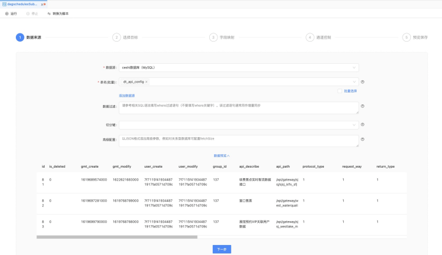
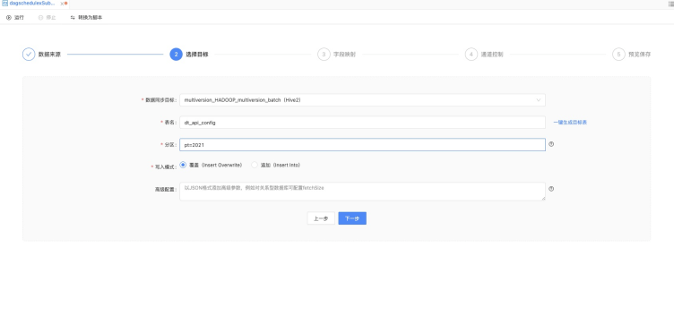
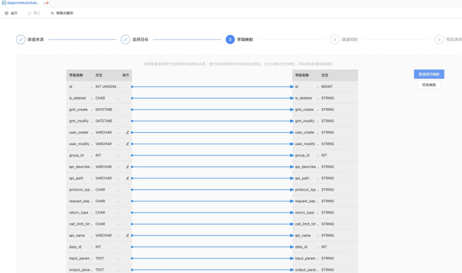
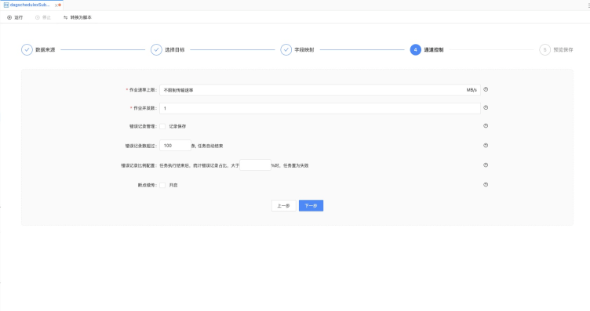
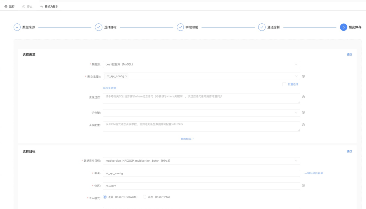
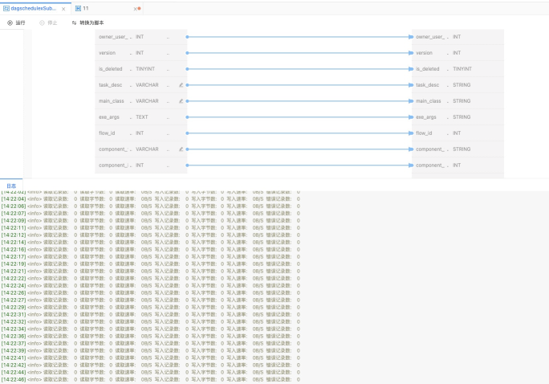
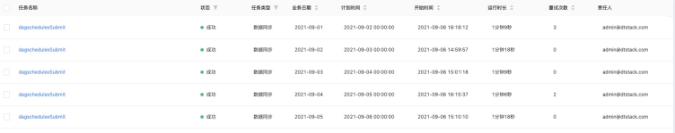

#### Taiga 任务提交快速开始

本文主要面对DAGScheduleX的使用者，通过一个示例来介绍如何使用DAGScheduleX来实现数据同步任务的提交
关于数据同步任务FlinkX的详细文档请参考[flinkx](https://github.com/DTStack/flinkx)

* 通过flinkx来实现基于flink的分布式离线和实时的数据同步框架，实现了多种异构数据源之间高效的数据迁移
* 通过DAGScheduleX来实现flinkx任务的提交

#### 前提条件

* 启动DAGScheduleX并配置好对应的集群信息，确保绑定集群中有相应的flink组件信息
* DAGScheduleX环境中包含控制台配置的flinkx插件包路径
* DAGScheduleX目录下有相应的flink任务提交插件包
* DAGScheduleX配置的集群环境测试连通性能正确通过

#### 构建参数

DAGScheduleX中每种任务对应的提交参数都不一样:

这里以flinkx数据同步的任务参数为例，数据同步的任务json中包含了三大部分

**reader(源数据库)** : 数据从哪里读取，读取那些字段，从那个增量标识开始读取都是配置在这里

**writer(目标数据库)** : 读取的数据，写入到哪里都是配置在这里

**setting(配置信息)**: 可以设置错误记录阀值数、错误占比阀值，便于任务出错之后及时停止，以免浪费资源,可以设置作业并发度和作业速率，提交数据同步任务速度


启动了DAGScheduleX，您就可以参考以下二种方式实现，提交flinkx数据同步任务

##### 向导模式构建参数

可以通过DAGScheduleX的向导模式界面即可配置提交，但需要在数据源中心提前引入对应数据同步任务的输入和输出数据源信息

1. **配置数据读取目标**

&emsp;&emsp;&emsp;&emsp;&emsp;数据读取目标: 读取数据的来源，对应flinkx配置中的reader参数信息




2. **配置数据写入目标**

&emsp;&emsp;&emsp;&emsp;&emsp;数据读取目标: 数据写入的目标，对应flinkx配置中的writer参数信息



3. **配置读取写入的字段映射信息**

&emsp;&emsp;&emsp;&emsp;&emsp;设置读取和写入字段一一对应关系，校验读取写入的字段格式是否正确


4. **配置任务提交的配置信息**

&emsp;&emsp;&emsp;&emsp;&emsp;配置信息对应flinkx配置中的setting参数信息 包括（作业速率、并发数、错误记录数）


5. **保存预览**



##### 脚本构建参数

脚本模式的参数和flinkx的参数信息保持完全一致,包含writer、reader、setting的参数信息

脚本模式不依赖数据源插件和操作界面的支持、可扩展性更强

```
{
  "job" : {
    "content" : [ {
      "reader" : {
        "parameter" : {
          "customSql" : "",
          "startLocation" : "",
          "increColumn" : "",
          "column" : [ {
            "name" : "id",
            "type" : "INT",
            "key" : "id"
          }, {
            "name" : "222",
            "format" : "",
            "type" : "STRING",
            "value" : "222",
            "key" : "222"
          }, {
            "name" : "weqwe",
            "format" : "",
            "type" : "DATE",
            "value" : "2020-08-09",
            "key" : "weqwe"
          } ],
          "connection" : [ {
            "sourceId" : 157,
            "password" : "******",
            "jdbcUrl" : [ "jdbc:mysql://172.16.100.115:3306/ide" ],
            "type" : 1,
            "table" : [ "pg_test2" ],
            "username" : "drpeco"
          } ],
          "sourceIds" : [ 157 ]
        },
        "name" : "mysqlreader"
      },
      "writer" : {
        "parameter" : {
          "postSql" : [ "delete from cata where id =1 ", "delete from cata where id =3 " ],
          "password" : "******",
          "session" : [ ],
          "column" : [ {
            "name" : "project_id",
            "type" : "INT",
            "key" : "project_id"
          }, {
            "name" : "tenant_id",
            "type" : "INT",
            "key" : "tenant_id"
          }, {
            "name" : "record_type",
            "type" : "INT",
            "key" : "record_type"
          } ],
          "connection" : [ {
            "jdbcUrl" : "jdbc:mysql://172.16.100.115:3306/ide",
            "table" : [ "cata" ]
          } ],
          "writeMode" : "insert",
          "sourceIds" : [ 157 ],
          "username" : "drpeco",
          "preSql" : [ "delete from cata where id =1 ", "delete from cata where id =3 " ]
        },
        "name" : "mysqlwriter"
      }
    } ],
    "setting" : {
      "dirty" : {
        "path" : "dirty_11_copy2",
        "hadoopConfig" : {
          "dfs.ha.namenodes.ns1" : "nn1,nn2",
          "dfs.namenode.rpc-address.ns1.nn2" : "kudu2:9000",
          "dfs.client.failover.proxy.provider.ns1" : "org.apache.hadoop.hdfs.server.namenode.ha.ConfiguredFailoverProxyProvider",
          "dfs.namenode.rpc-address.ns1.nn1" : "kudu1:9000",
          "dfs.nameservices" : "ns1"
        }
      },
      "restore" : {
        "maxRowNumForCheckpoint" : 0,
        "isRestore" : false,
        "restoreColumnName" : "",
        "restoreColumnIndex" : 0
      },
      "errorLimit" : {
        "record" : 101
      },
      "speed" : {
        "bytes" : 0,
        "channel" : 1
      }
    }
  }
}
```

#### 任务提交

```flow
  start=>start: 开始任务
  replace=>operation: 替换任务参数
  resource=>condition: 是否有资源
  submit=>operation: 提交任务
  timeWait=>operation: 限时等待
  submit=>operation: 提交任务
  jobId=>condition: 返回提交任务信息
  status=>operation: 获取状态
  log=>operation: 获取日志
  ed=>end: 任务结束
  
  start->replace->resource
  resource(yes)->submit
  resource(no)->timeWait
  timeWait->submit
  submit->jobId
  jobId(yes)->status->log->ed
  jobId(no)->ed
 
```

##### 提交任务

任务来源区分为界面临时运行、周期调度、补数据等三种方式，但最终函数都为actionService.start

构建好任务参数提交到对应start方法的时候，会校验任务的必要参数信息:任务唯一标识、任务引擎类型、任务唯一标识等信息


##### 参数替换

DAGScheduleX支持系统变量和自定义变量

如果任务提交的参数信息中包含定义变量、在开始任务之后，会根据对应的格式替换这些参数信息


##### 提交条件

任务提交之前都需要做对应的提交判断，确认任务是否满足提交提交条件

以session模式的数据同步任务为例: 任务提交之前会判断yarn上是否有flink session任务，session中slot资源是否满足该任务等


##### 提交任务

任务满足提交条件之后，执行提交逻辑，这里提交的实现由DAGScheduleX中任务提交插件去实现

任务提交之后，需要返回一个唯一标识，如yarn的applicationId，后续任务获取状态和日志都依赖该唯一标识


##### 获取状态

任务提交完成之后，会根据唯一标识，会间断的获取任务状态


##### 获取日志

当任务执行完之后，会获取任务的部分日志信息

#### 任务运行

##### 临时运行
任务在DAGScheduleX平台上配置完成之后点击运行，任务运行完成之后可以在平台上可以看到输出的日志信息，用于任务调试



##### 周期运行
任务参数配置完成之后，可以配置任务的调度属性，完成提交之后，任务会周期性的调度运行


