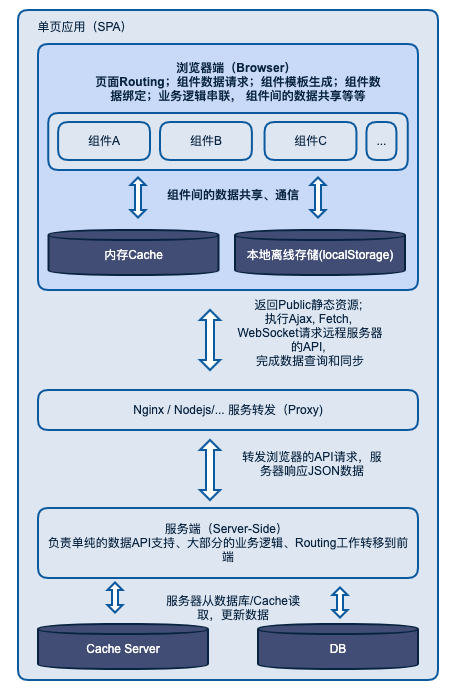
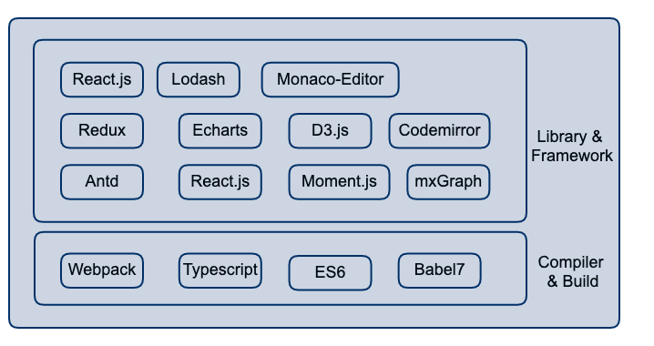

# 数栈前端项目架构设计

## 项目简介

这是一个主要基于 Webpack + React + Redux + Antd 技术的，且前后分离的 Web 单页应用。

## 设计目标

- 单页 SPA 应用
- 前后端分离
- 可自由打包个单独或多个项目
- 适宜多人协作开发
- 兼容包含原有 RDOS 项目
- 保留未来可能拆分成独立项目的可能
- 根据打包项目所在独立维护的状态树（保证性能）
- 每个应用独立的模板页和 app.js
- 应用展示菜单可通过配置控制

## 设计原则
技术架构中用到的技术库或者框架，需要秉承一些基本原则，具体如下：

- 项目允许情况下，能自己写的，尽量不用第三方的（确保完全的掌控权）
- 所选用的框架或者库需要成熟的社区支撑，或者自己有完全掌控的能力
- 引入新技术前，需要跟组员沟通交流，并做过充分学习

## 应用架构图

下图为前后端分离 SPA 的架构图：

<div style="text-align:center"></div>

## 技术库和框架

下图为具体开发应用的技术点：

<div style="text-align:center"></div>

#### 基本技术库和框架
- React.js
- Antd v2.13.11
- Redux
- Sass
- Styled Component
- Lodash
- Echarts
- mxGraph
- Monaco-Editor
- Moment.js
- D3.js

#### 其他技术点
- Webpack4
- Babel7
- ES6
- PWA
- ESLint


## 项目基本结构

#### 开发结构
```bash
| - data-stack
    | - node_modules npm安装模块
    | - build 配置文件目录，主要包含Webpack配置
        | - base
        | - dev
        | - prod
        | - config.js
    | - dist 分发目录
    | - document 文档
    | - scripts 辅助脚本，例如ssh登录到测试环境
    | - src
        | - funcs   零碎的公共方法
        | - widgets 全局UI小组件
        | - consts   全局常量
        | - theme   主题配置文件
        | - utils 工具文件
            | - index.js 默认工具模块
            | - asyncLoader.js 异步加载js模块
            | - localDb.js localStorage操作
            | - pureRender.js 纯渲染装饰器
            | - reduxUtils.js redux工具
        | - config
            | - appConf.js 配置应用数量
        | - public 静态公开资源
            | - iconfont
            | - main
                | - config
                | - img
                | - js
                | - index.html 模板页
            | - rdos
                | - ...
            | - dataQuality
                | - ...
            | - favicon.ico
        | - webapps 各应用部分
            | - main 主应用
                | - api
                | - constants
                | - actions
                | - reducers
                | - styles 样式文件
                | - components 应用组件
                | - views
                    | - layout
                    | - project
                    | - user
                | - app.js
                | - routers.js 路由
                | - interceptor.js 拦截器
            | - rdos RD-OS
            | - dataQuality 数据质量
            | - dataApi 数据API
    | - .babelrc babel配置
    | - eslintrc.json eslint配置，可以自定义规则
    | - config.js 配置文件，包括devServer的相关信息
    | - README.md 文档
```

#### 编译输出结构
```bash
| - dt-stack
    | - index.html
    | - rdos.html
    | - dataQuality.html
    | - public
        | - main
        | - rdos
        | - ...
    | - app.js
    | - vendor.js
    | - rdos.js
    | - dataQuality.js
    | - ...
```

## 架构优势
- 前后端分离：更好的前端交互体验，，提升前端开发效率
- 单页 SPA 架构：提供类 Native 应用开发体验
- 基于 Webpack, React 生态：提供了强大的社区优化插件、以及丰富的交互组件
- 集成 PWA： 提供更快的页面加载性能
- 支持多应用集成
- 支持 Typescript, 代码维护性、健壮性更好
- ..
