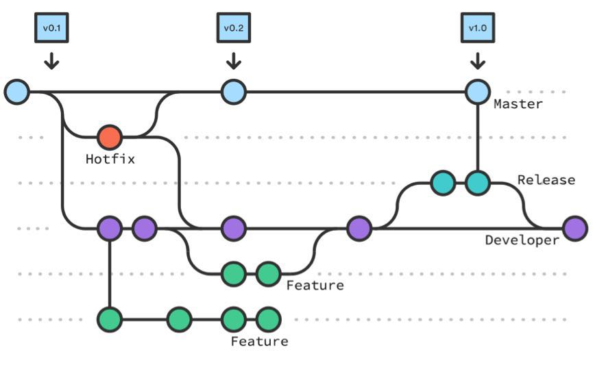

# 版本号规则：
- 修订版本号：日常 bugfix 更新。（如果有紧急的 bugfix，则任何时候都可发布）
- 次版本号：带有新特性的向下兼容的版本。
- 主版本号：含有破坏性更新和新特性。

# 项目 Git Workflow 使用说明
由于当前项目的一些特殊性，并且伴随更多小伙伴一起在当前代码上做迭代开发，所以对当前的 Git 使用需要做一些说明，指定统一大家当前项目 Git 工作流。

关于 Git 方面的工作流有很多种，目前我们相对倾向根据自己业务和团队特性来选择适合的协作模式。目前的工作流模式较多，目前我们暂时使用 gitflow 工作流的方式进行项目协作。

# Gitflow 工作流

# 分支
maser，dev 都为长期分支，release, feature, hotfix都是根据实际情况衍生的短期分支。

### 主分支 （master）
始终稳定的分支，主要用于发布生产环境（Production) , 并在相应的版本发布时间点打上相应的版本 tag。  当生产环境出现紧急bug 后，从 master 衍生 hotfix 分支，并进行 bugfix 开发。需要注意的是，master 分支除了与 pre-release 分支有直接的 merge 操作外，不会与 dev 和其他任何 feature 分支进行 merge 操作，除去要进行紧急的 hotfix 分支以外。

### 开发分支（dev）
用于日常正常的开发迭代，大部分的 feature 分支从 dev 衍生，开发完后会合并到dev，并发布到开发测试环境。当开发版本相对稳定，并进入发布日期后，从 dev 衍生 相对应的 pre-release 版本。

### 预发布分支（release branch）
此分支是从 dev 分支衍生，为一个预发布分支，介于 master 与 dev分支之间。主要用于开发测试环境和稳定版本之间的缓冲，主要有以下作用：

 * 清理发布
 * 执行所有测试
 * 更新文档
 * 为下个发布做准备操作
 
命名规则为：release_版本号， 例如：release_v1.0.0

### 功能分支 （feature branch)
从 dev 分支衍生，用于新功能模块的开发。当新功能模块开发完毕后，可合并到 dev 分支，发布到开发测试环境进行功能测试。
* dev_ide
* dev_valid
* dev_api
* dev_tag
* …

### 补丁分支 （hotfix branch）
命名： hotfix