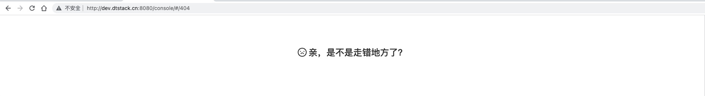
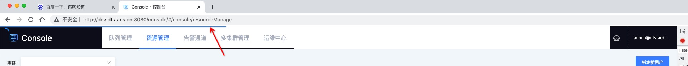
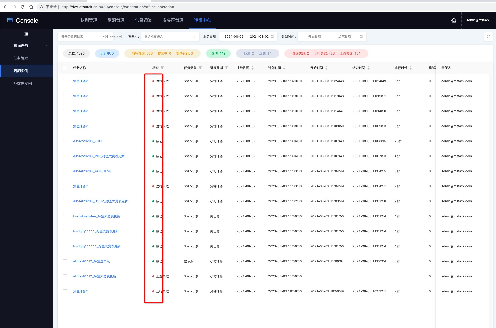
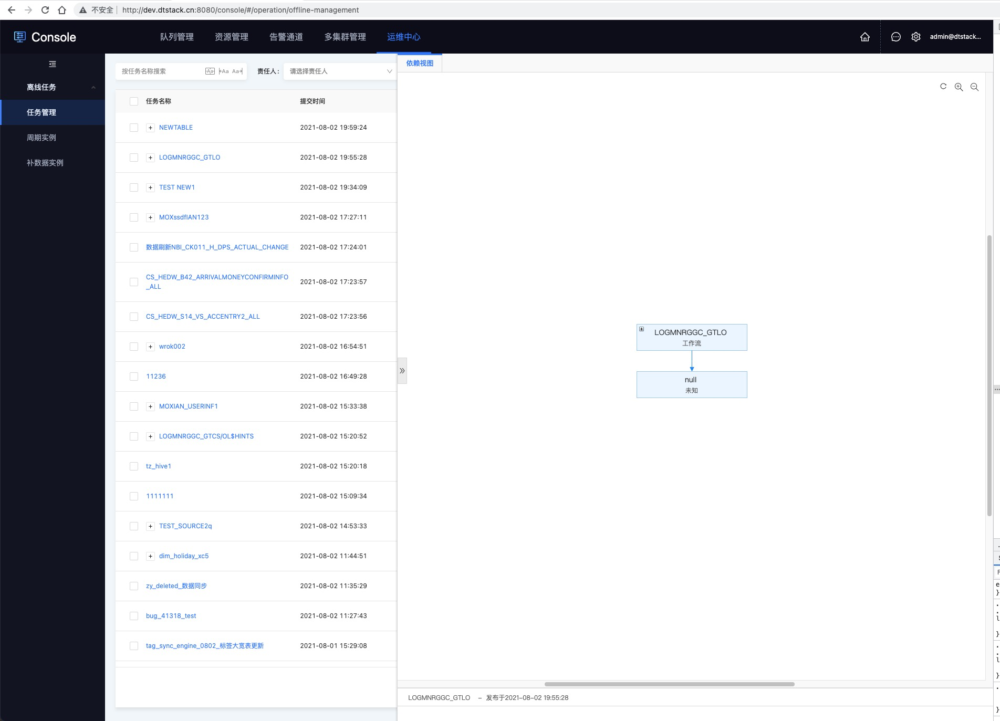
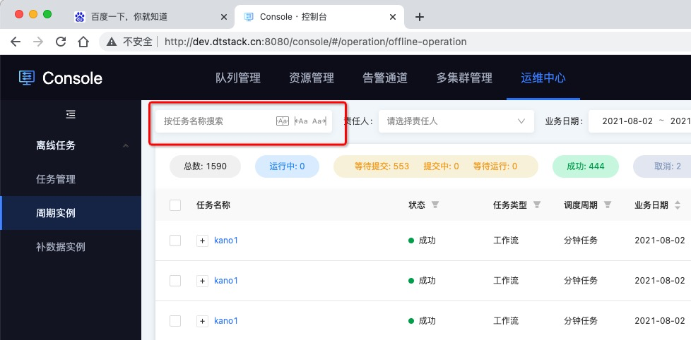
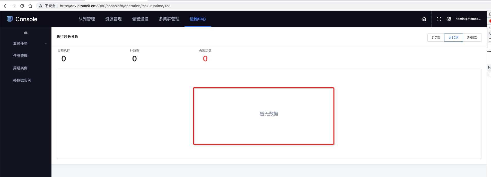

# 替换 dt-common

## NotFound

404 页面

## ProgressBar

请求接口时头顶会有进度条闪动，因为背景也是深色，很难看清

## Circle

小圆点颜色

## SlidePane

侧边栏能否正常打开，关闭

## MultiSearchInput

搜索框精确、头部、尾部匹配能否正常

## Resize

浏览器宽度变化后，图表宽度能跟随浏览器宽度一起变化

