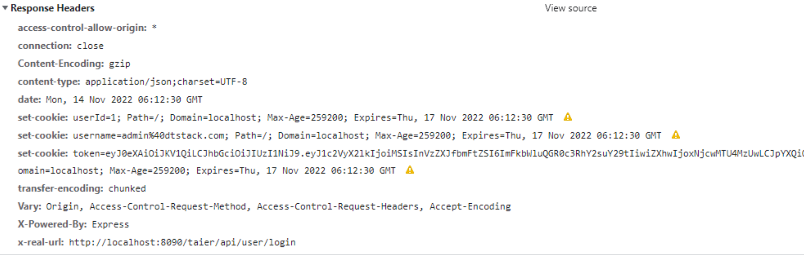

## 常见问题
### 任务运行 直接报错
```java
com.dtstack.taier.common.exception.ClientAccessException: Client access exception.
at com.dtstack.taier.common.client.ClientCache.getClient(ClientCache.java:114)
at com.dtstack.taier.common.client.ClientOperator.judgeSlots(ClientOperator.java:155)
at com.dtstack.taier.scheduler.WorkerOperator.judgeSlots(WorkerOperator.java:93)
at com.dtstack.taier.scheduler.WorkerOperator$$FastClassBySpringCGLIB$$b285a6bd.invoke(<generated>)
at org.springframework.cglib.proxy.MethodProxy.invoke(MethodProxy.java:218)
at org.springframework.aop.framework.CglibAopProxy$CglibMethodInvocation.invokeJoinpoint(CglibAopProxy.java:769)
at org.springframework.aop.framework.ReflectiveMethodInvocation.proceed(ReflectiveMethodInvocation.java:163)
at org.springframework.aop.framework.CglibAopProxy$CglibMethodInvocation.proceed(CglibAopProxy.java:747)
at org.springframework.aop.framework.adapter.AfterReturningAdviceInterceptor.invoke(AfterReturningAdviceInterceptor.java:55)
at org.springframework.aop.framework.ReflectiveMethodInvocation.proceed(ReflectiveMethodInvocation.java:186)
at org.springframework.aop.framework.CglibAopProxy$CglibMethodInvocation.proceed(CglibAopProxy.java:747)
at org.springframework.aop.interceptor.ExposeInvocationInterceptor.invoke(ExposeInvocationInterceptor.java:95)
at org.springframework.aop.framework.ReflectiveMethodInvocation.proceed(ReflectiveMethodInvocation.java:186)
at org.springframework.aop.framework.CglibAopProxy$CglibMethodInvocation.proceed(CglibAopProxy.java:747)
at org.springframework.aop.framework.CglibAopProxy$DynamicAdvisedInterceptor.intercept(CglibAopProxy.java:689)
at com.dtstack.taier.scheduler.WorkerOperator$$EnhancerBySpringCGLIB$$9dd74da7.judgeSlots(<generated>)
at com.dtstack.taier.scheduler.jobdealer.JobSubmitDealer.submitEngineJob(JobSubmitDealer.java:340)
at com.dtstack.taier.scheduler.jobdealer.JobSubmitDealer.submitJob(JobSubmitDealer.java:329)
at com.dtstack.taier.scheduler.jobdealer.JobSubmitDealer.lambda$run$0(JobSubmitDealer.java:220)
at java.util.concurrent.Executors$RunnableAdapter.call(Executors.java:511)
at java.util.concurrent.FutureTask.run(FutureTask.java:266)
at java.util.concurrent.ThreadPoolExecutor.runWorker(ThreadPoolExecutor.java:1149)
at java.util.concurrent.ThreadPoolExecutor$Worker.run(ThreadPoolExecutor.java:624)
at java.lang.Thread.run(Thread.java:748)
```

:::tip
taier部署目录下没有worker-plugins
:::

### 新建任务下拉框为空 或者 没有数据同步任务类型
:::tip
任务下拉框为空 查看初始化SQL是否正常执行 `dict`表中type = 30 是否正常 不包含重复数据  
没有数据同步任务类型 或者没有其他任务类型 确认前置组件是否正常配置 [组件任务依赖关心](./functions/multi-cluster.md)
:::


### 不依赖hadoop 可以实现异构数据源之间的数据同步吗
:::tip
可以本地部署`Flink Standalone` 或 `DataX`  通过数据同步任务或者DataX来实现同步
:::

### 数据同步版本可以用其他版本吗
:::tip
不行 Chunjun对接的版本为1.12_release Taier项目依赖的也为1.12 建议使用Flink版本1.12.7
:::

### 任务提交报错 提示找不到core-jar
```java
Caused by: com.dtstack.taier.common.exception.TaierDefineException: java.util.concurrent.ExecutionException: com.dtstack.taier.common.exception.TaierDefineException: com.dtstack.taier.pluginapi.exception.PluginDefineException: Can not find chunjun core jar in path: /usr/local/chunjun-dist
at com.dtstack.taier.common.client.ClientProxy.init(ClientProxy.java:90)
at com.dtstack.taier.common.client.ClientCache.getClient(ClientCache.java:102)
... 23 more
Caused by: java.util.concurrent.ExecutionException: com.dtstack.taier.common.exception.TaierDefineException: com.dtstack.taier.pluginapi.exception.PluginDefineException: Can not find chunjun core jar in path: /usr/local/chunjun-dist
at java.util.concurrent.CompletableFuture.reportGet(CompletableFuture.java:357)
at java.util.concurrent.CompletableFuture.get(CompletableFuture.java:1915)
at com.dtstack.taier.common.client.ClientProxy.init(ClientProxy.java:86)
... 24 more
Caused by: com.dtstack.taier.common.exception.TaierDefineException: com.dtstack.taier.pluginapi.exception.PluginDefineException: Can not find chunjun core jar in path: /usr/local/chunjun-dist
at com.dtstack.taier.common.client.ClientProxy.lambda$init$0(ClientProxy.java:84)
at java.util.concurrent.CompletableFuture$AsyncSupply.run(CompletableFuture.java:1590)
... 3 more
Caused by: com.dtstack.taier.pluginapi.exception.PluginDefineException: Can not find chunjun core jar in path: /usr/local/chunjun-dist
at com.dtstack.taier.flink.config.PluginConfig.getCoreJarPath(PluginConfig.java:106)
at com.dtstack.taier.flink.config.PluginConfig.getCoreJarInfo(PluginConfig.java:83)
at com.dtstack.taier.flink.util.FlinkUtil.fillFlinkxToClassLoader(FlinkUtil.java:272)
at com.dtstack.taier.flink.FlinkClient.init(FlinkClient.java:156)
at com.dtstack.taier.common.client.ClientProxy$1.execute(ClientProxy.java:79)
at com.dtstack.taier.common.client.ClientProxy$1.execute(ClientProxy.java:76)
at com.dtstack.taier.pluginapi.callback.ClassLoaderCallBackMethod.callbackAndReset(ClassLoaderCallBackMethod.java:31)
at com.dtstack.taier.common.client.ClientProxy.lambda$init$0(ClientProxy.java:76)
... 4 more
```
:::tip 
chunjun-core.jar 寻找的目录是`taier`服务器本地 需要确保目录、权限、chunjun-dist目录正常  
如果是docker部署的话 需要将chunjun 和flink的目录映射到docker内挂载  
```xml
    volumes:
      - /data/chunjun-dist:/usr/local/chunjun-dist
```
:::


### Flink 任务提交之后状态获取timeout
```java
2022-11-09 08:03:34.803 [pool-FlinkClient_ClientProxy-24-thread-50] WARN  o.a.flink.client.program.rest.RestClusterClient [RestClusterClient.java:699] - Could not retrieve the web interface URL for the cluster.
java.util.concurrent.ExecutionException: java.util.concurrent.TimeoutException
        at java.util.concurrent.CompletableFuture.reportGet(CompletableFuture.java:357)
        at java.util.concurrent.CompletableFuture.get(CompletableFuture.java:1908)
```

:::tip
Flink任务提交之后会有随机端口产生，Hadoop集群的网络需要和Taier互通，不限制端口访问
:::


### Flink-Standalone 任务提交类转换异常
```java
Caused by: java.lang.reflect.InvocationTargetException
at sun.reflect.NativeMethodAccessorImpl.invoke0(Native Method)
at sun.reflect.NativeMethodAccessorImpl.invoke(NativeMethodAccessorImpl.java:62)
at sun.reflect.DelegatingMethodAccessorImpl.invoke(DelegatingMethodAccessorImpl.java:43)
at java.lang.reflect.Method.invoke(Method.java:498)
at java.lang.invoke.SerializedLambda.readResolve(SerializedLambda.java:230)
at sun.reflect.GeneratedMethodAccessor13.invoke(Unknown Source)
at sun.reflect.DelegatingMethodAccessorImpl.invoke(DelegatingMethodAccessorImpl.java:43)
at java.lang.reflect.Method.invoke(Method.java:498)
at java.io.ObjectStreamClass.invokeReadResolve(ObjectStreamClass.java:1275)
... 69 more
Caused by: java.lang.ClassCastException: com.dtstack.chunjun.connector.jdbc.converter.JdbcColumnConverter cannot be cast to com.dtstack.chunjun.converter.AbstractRowConverter
at com.dtstack.chunjun.converter.AbstractRowConverter.$deserializeLambda$(AbstractRowConverter.java:54)
... 78 more

```
:::tip
Flink-Standalone服务fink-config.yml增加类加载配置解决  
```xml
classloader.resolve-order: parent-first
classloader.check-leaked-classloader: false
```
:::


### Spark 任务提交类not find
```java
Could not find or load main class org.apache.spark.executor.CoarseGrainedExecutorBackend
```
:::tip
Spark组件`sparkSqlProxyPath` 配置的路径下上传对应依赖jar包
:::


### 本地部署登录之后提示未登录

:::tip
本地通过访问http://ip:8090/
:::


### 选择数据源提示初始化失败
```java
com.dtstack.taier.datasource.api.exception.InitializeException: get classloader error, pluginName: mysql5
	at com.dtstack.taier.datasource.api.manager.list.ClassloaderManager.lambda$getClassloaderByPluginName$0(ClassloaderManager.java:184)
	at java.util.concurrent.ConcurrentHashMap.computeIfAbsent(ConcurrentHashMap.java:1660)
	at com.dtstack.taier.datasource.api.manager.list.ClassloaderManager.getClassloaderByPluginName(ClassloaderManager.java:178)
	at com.dtstack.taier.datasource.api.manager.list.ClientManager.registerClient(ClientManager.java:90)
	at com.dtstack.taier.datasource.api.base.ClientCache.getClientByType(ClientCache.java:74)
	at com.dtstack.taier.datasource.api.base.ClientCache.getClient(ClientCache.java:78)
```

:::tip 
确保taier部署环境存在同级目录datasource-plugins
:::

### 数据同步任务一直等待运行
:::tip
session 模式 确认 flink session是否拉起  可以参考github issue
standalone 默认 确认 standalone是否正常启动 组件参数配置是否正常 
等待运行的信息可以在`taier.log`日志中查看
:::

### 数据同步任务运行class not found

  
:::tip 
chunjun的connector部分依赖包是provided,运行时候需要下载对应jar包放在flink组件配置的`flinkLibDir`目录下
:::

### 数据同步运行serialVersionUID错误

  
:::tip 
chunjun的connector更换过之后，需要重启Taier和Flink Session
:::

### 数据同步运行 session拉启失败

  
:::tip 
检查Node Manager 是否健康 以及 是否能手动拉启Flink Session
:::

### 数据同步运行 数据写入 但是界面指标展示为0

:::tip
指标数据来源于prometheus地址，指标展示为0的话
1. 普罗米修斯没有数据
2. prometheus服务器和Taier服务器、数据库时间不一致,时间间隔取值不对
3. Chunjun的指标信息推送为异步 数据过少 可能任务已经结束 指标还未推送
4. Flink组件promgateway或prometheus地址、端口不正确
:::

### Flink Session 运行之后 不断被kill

:::tip 
查看/logs/taier_flink_monitor.log日志 是否有hosts等信息未配置导致
:::

### Taier-UI编译失败

:::tip 
手动通过npm等方式编译或者删除Taier-ui下node_modules目录再次编译 npm版本建议v16.16
:::

### Taier等插件包编译失败

:::tip 
修改Maven仓库镜像地址为阿里云Maven镜像地址
:::

### Taier支持1.16吗

:::tip 
Taier支持高版本的Flink或Spark 需要提交插件开发适配才能支持，最新版本还未发布的话，就是暂未支持
:::

### 提交sparkjar运行，出现Error: Could not find or load main class org.apache.spark.deploy.yarn.ApplicationMaster

:::tip
[是否正确上传$SPARK_HOME/jars下的包到spark组件sparkYarnArchive配置到HDFS路径下](https://dtstack.github.io/Taier/docs/functions/component/spark#%E8%87%AA%E5%AE%9A%E4%B9%89%E5%8F%82%E6%95%B0)
:::

### 任务提交到Yarn默认用户为admin 如何调整

:::tip 
application.properties 配置hadoop.user.name=hdfs 重启Taier  更多参数参考 EnvironmentContext类
:::

### Yarn或Hdfs测试连通性不过
:::tip 
确认集群对应的计算节点host信息是否在Taier的服务器或镜像配置正确  
测试连通性是通过YarnClient和组件进行连接测试，确保网络连接正常
:::

### logback类加载不到
:::tip
参考[issue](https://github.com/DTStack/Taier/issues/985) 把logback-core-1.2.11.jar、logback-classic-1.2.11.jar 放入到`flinkLibDir`目录下 并重新拉起Flink Session
:::

### 任务提交显示资源不足
:::tip
确认集群的cpu、内存或flink slot数量是否足够
:::

### 如果访问页面提示空白
:::tip

如果访问页面提示空白 原因为前端dist文件不存在 需要编译后在启动 参考本地启动文档
:::