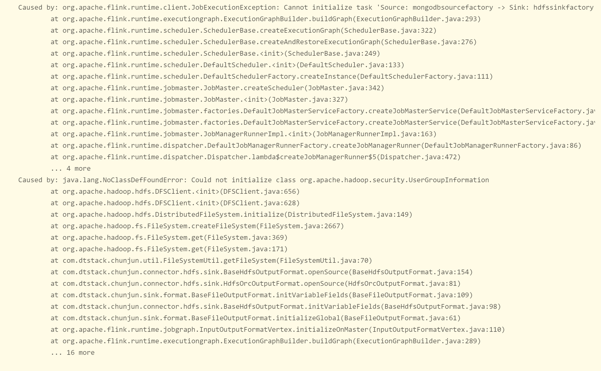
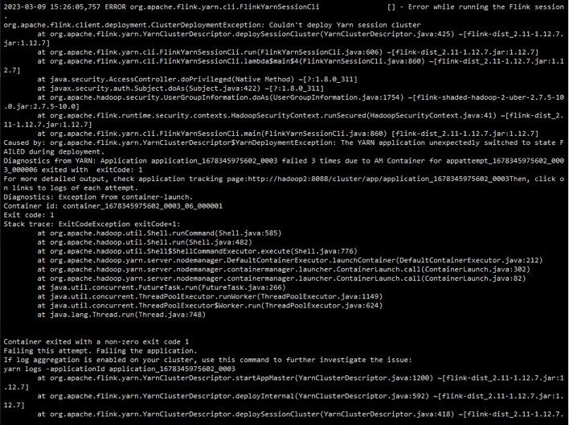

## 常见问题

### 任务提交报错 提示找不到core-jar
```java
Caused by: com.dtstack.taier.common.exception.TaierDefineException: java.util.concurrent.ExecutionException: com.dtstack.taier.common.exception.TaierDefineException: com.dtstack.taier.pluginapi.exception.PluginDefineException: Can not find chunjun core jar in path: /usr/local/chunjun-dist
at com.dtstack.taier.common.client.ClientProxy.init(ClientProxy.java:90)
at com.dtstack.taier.common.client.ClientCache.getClient(ClientCache.java:102)
... 23 more
Caused by: java.util.concurrent.ExecutionException: com.dtstack.taier.common.exception.TaierDefineException: com.dtstack.taier.pluginapi.exception.PluginDefineException: Can not find chunjun core jar in path: /usr/local/chunjun-dist
at java.util.concurrent.CompletableFuture.reportGet(CompletableFuture.java:357)
at java.util.concurrent.CompletableFuture.get(CompletableFuture.java:1915)
at com.dtstack.taier.common.client.ClientProxy.init(ClientProxy.java:86)
... 24 more
Caused by: com.dtstack.taier.common.exception.TaierDefineException: com.dtstack.taier.pluginapi.exception.PluginDefineException: Can not find chunjun core jar in path: /usr/local/chunjun-dist
at com.dtstack.taier.common.client.ClientProxy.lambda$init$0(ClientProxy.java:84)
at java.util.concurrent.CompletableFuture$AsyncSupply.run(CompletableFuture.java:1590)
... 3 more
Caused by: com.dtstack.taier.pluginapi.exception.PluginDefineException: Can not find chunjun core jar in path: /usr/local/chunjun-dist
at com.dtstack.taier.flink.config.PluginConfig.getCoreJarPath(PluginConfig.java:106)
at com.dtstack.taier.flink.config.PluginConfig.getCoreJarInfo(PluginConfig.java:83)
at com.dtstack.taier.flink.util.FlinkUtil.fillFlinkxToClassLoader(FlinkUtil.java:272)
at com.dtstack.taier.flink.FlinkClient.init(FlinkClient.java:156)
at com.dtstack.taier.common.client.ClientProxy$1.execute(ClientProxy.java:79)
at com.dtstack.taier.common.client.ClientProxy$1.execute(ClientProxy.java:76)
at com.dtstack.taier.pluginapi.callback.ClassLoaderCallBackMethod.callbackAndReset(ClassLoaderCallBackMethod.java:31)
at com.dtstack.taier.common.client.ClientProxy.lambda$init$0(ClientProxy.java:76)
... 4 more
```
:::tip 
chunjun-core.jar 寻找的目录是`taier`服务器本地 需要确保目录、权限、chunjun-dist目录正常  
如果是docker部署的话 需要将chunjun 和flink的目录映射到docker内挂载  
```xml
    volumes:
      - /data/chunjun-dist:/usr/local/chunjun-dist
```
:::


### Flink 任务提交之后状态获取timeout
```java
2022-11-09 08:03:34.803 [pool-FlinkClient_ClientProxy-24-thread-50] WARN  o.a.flink.client.program.rest.RestClusterClient [RestClusterClient.java:699] - Could not retrieve the web interface URL for the cluster.
java.util.concurrent.ExecutionException: java.util.concurrent.TimeoutException
        at java.util.concurrent.CompletableFuture.reportGet(CompletableFuture.java:357)
        at java.util.concurrent.CompletableFuture.get(CompletableFuture.java:1908)
```

:::tip
Flink任务提交之后会有随机端口产生，Hadoop集群的网络需要和Taier互通，不限制端口访问
:::


### Flink-Standalone 任务提交类转换异常
```java
Caused by: java.lang.reflect.InvocationTargetException
at sun.reflect.NativeMethodAccessorImpl.invoke0(Native Method)
at sun.reflect.NativeMethodAccessorImpl.invoke(NativeMethodAccessorImpl.java:62)
at sun.reflect.DelegatingMethodAccessorImpl.invoke(DelegatingMethodAccessorImpl.java:43)
at java.lang.reflect.Method.invoke(Method.java:498)
at java.lang.invoke.SerializedLambda.readResolve(SerializedLambda.java:230)
at sun.reflect.GeneratedMethodAccessor13.invoke(Unknown Source)
at sun.reflect.DelegatingMethodAccessorImpl.invoke(DelegatingMethodAccessorImpl.java:43)
at java.lang.reflect.Method.invoke(Method.java:498)
at java.io.ObjectStreamClass.invokeReadResolve(ObjectStreamClass.java:1275)
... 69 more
Caused by: java.lang.ClassCastException: com.dtstack.chunjun.connector.jdbc.converter.JdbcColumnConverter cannot be cast to com.dtstack.chunjun.converter.AbstractRowConverter
at com.dtstack.chunjun.converter.AbstractRowConverter.$deserializeLambda$(AbstractRowConverter.java:54)
... 78 more

```
:::tip
Flink-Standalone服务fink-config.yml增加类加载配置解决  
```xml
classloader.resolve-order: parent-first
classloader.check-leaked-classloader: false
```
:::


### Spark 任务提交类not find
```java
Could not find or load main class org.apache.spark.executor.CoarseGrainedExecutorBackend
```
:::tip
Spark组件`sparkSqlProxyPath` 配置的路径下上传对应依赖jar包
:::


### 本地部署登录之后提示未登录

:::tip
本地通过访问http://localhost:8090/
:::


### 选择数据源提示初始化失败
```java
com.dtstack.taier.datasource.api.exception.InitializeException: get classloader error, pluginName: mysql5
	at com.dtstack.taier.datasource.api.manager.list.ClassloaderManager.lambda$getClassloaderByPluginName$0(ClassloaderManager.java:184)
	at java.util.concurrent.ConcurrentHashMap.computeIfAbsent(ConcurrentHashMap.java:1660)
	at com.dtstack.taier.datasource.api.manager.list.ClassloaderManager.getClassloaderByPluginName(ClassloaderManager.java:178)
	at com.dtstack.taier.datasource.api.manager.list.ClientManager.registerClient(ClientManager.java:90)
	at com.dtstack.taier.datasource.api.base.ClientCache.getClientByType(ClientCache.java:74)
	at com.dtstack.taier.datasource.api.base.ClientCache.getClient(ClientCache.java:78)
```

:::tip 确保taier部署环境存在同级目录datasource-plugins
:::

### 数据同步任务运行class not found

  
:::tip chunjun的connector部分依赖包是provided,运行时候需要下载对应jar包放在flink组件配置的`flinkLibDir`目录下
:::

### 数据同步运行serialVersionUID错误

  
:::tip chunjun的connector更换过之后，需要重启Taier和Flink Session
:::

### 数据同步运行 session拉启失败

  
:::tip 检查Node Manager 是否健康 以及 是否能手动拉启Flink Session
:::

### 数据同步运行 数据写入 但是界面指标展示为0

:::tip 界面指标展示需要依赖Promethous服务器和Taier服务器、数据库时间一致  
Chunjun的指标信息推送为异步 数据过少 可能任务已经结束 指标还未推送
:::
