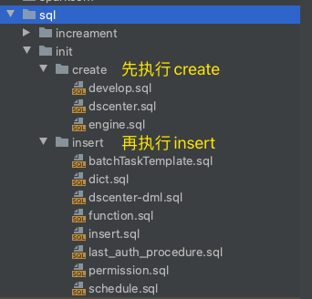

# 快速上手

## 数据库操作
### 数据库&表 初始化
1. 请登录 MySQL 数据库，创建名为 taiga 数据库
2. 初始化数据库，导入 `sql/init` 目录下的sql文件进行创建表及基础数据导入
    * 先执行 `sql/init/create`
    * 再执行 `sql/init/insert`

<div align="center"> 
    
</div>


## 如何编译

```Shell
    ./build/mvn-build.sh
```

## 检查运行目录
```
//启动脚本
|-- bin 
|---- base.sh
|---- centos_dagschedulex.sh

//配置文件
|-- conf 
|---- application.properties
|---- logback.xml

//编译 taiga-data-develop 对应jar文件
|-- lib 
|---- taiga-data-develop-XXXX-with-dependencies.jar

//编译 taiga-plugins 对应jar文件
|-- pluginLibs 
|---- dummy
|---- flinkcommon
|---- yarn2-hdfs2-flink110
|---- .......

//日志目录
|-- logs 

//flink 任务运行时日志配置
|-- flinkconf 

//数据源插件
|-- datasourceplugin

```

## 启动/停止
* 启动：`./bin/taiga.sh start`
* 停止：`./bin/taiga.sh stop`